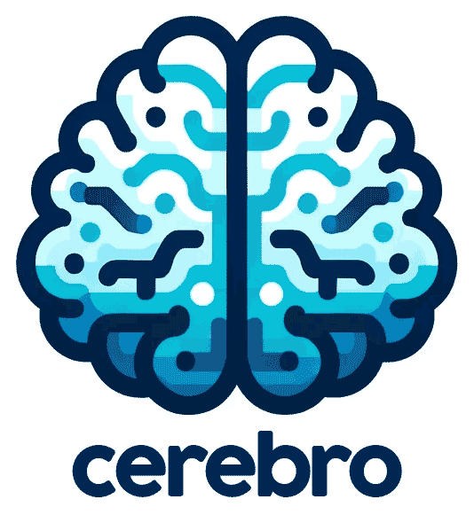
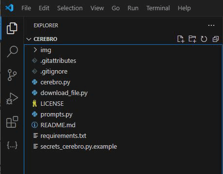

<p align="center">
    
</p>

# Cerebro - Bot Telegram

Cerebro é um bot do Telegram que tem o objetivo de ser seu segundo cérebro por meio do processamento de linguagem natural e inteligência artificial. Ele utiliza a LLMs para interpretar entradas de voz e texto, facilitando uma experiência única para alavancar seu potencial. Ideal para criadores, escritores e qualquer pessoa que deseje explorar e expandir suas ideias, o Cérebro atua como um parceiro usando ferramenta de inteligência artificial.

## Descrição


Principais Características já implementadas:
- Processamento de entradas de voz e texto
- Identificação e categorização de ideias
- Sessão de brainstorming automatizada com base nas ideias identificadas
- Armazenamento persistente de ideias e sessões para referência futura
- Modelo de interação flexível, apoiando tanto a exploração imediata quanto adiada das ideias

## Instalação

### Pré-requisitos

- Python 3.9+ (testado com Python 3.9.6 e 3.10.7)
- Uma conta no Telegram
- Chaves de API para OpenAI e Telegram Bot

### Configuração

1. **Copie os arquivos do projeto**: Baixe os arquivos projeto para sua máquina local e salve em uma pasta ou faça o clone do repositório do GitHub usando o comando `git clone`.
```sh
git clone https://github.com/mumunha/cerebro.git
```

2. **Navegue até o Diretório do Projeto**

Segue como arquivos devem estar apresentados no diretório do projeto:

<p align="center">
    
</p>

3. **Configure o Ambiente Python (Opcional, mas recomendado)**: Use um ambiente virtual para evitar conflitos com outros projetos.

#### Windows:

No prompt de comando ou no terminal do vscode.

Crie o ambiente virtual:

Se você tiver várias versões do Python, use o seguinte comando (substitua USERNAME pelo seu usuário):
```sh
C:\Users\USERNAME\AppData\Local\Programs\Python\Python310\python -m venv venv
```

```sh
python -m venv venv
```
Ative o ambiente virtual
Se for no <b>vscode</b> ou <b>PowerShell</b>
```sh
.\venv\Scripts\Activate.ps1
```
Se for no <b>prompt de comando</b>
```sh
.\venv\Scripts\activate.bat
```
4. **Instale as Dependências**: Instale os requisitos do projeto.

```sh
pip install -r requirements.txt
```

### Criando Seu Bot do Telegram com o BotFather

1. **Inicie o BotFather**: No Telegram, procure pela conta do BotFather (@BotFather), o bot oficial para criar e gerenciar bots do Telegram.

2. **Crie um Novo Bot**: Envie `/newbot` para o BotFather e siga as instruções. Você precisará fornecer um nome e um nome de usuário único para o seu bot.

3. **Obtenha o Token da API**: Após a criação bem-sucedida, o BotFather fornecerá um token da API para o seu novo bot. Esse token permite que seu bot se comunique com a API do Telegram.

4. **Configuração de APIs**: Renomeie `secrets_cerebro.py.example` para `secrets_cerebro.py` e preencha-o com suas chaves de API do Telegram e OpenAI conforme necessário.

## Executando o Cérebro

Execute `cerebro.py` para iniciar o bot:
```sh
python cerebro.py
```
Isso ativará o Cerebro na sua conta do Telegram, pronto para receber e processar suas entradas. Da primeira vez que você tentar conversar com o Cerebro ele não identificará você. Você precisará capturar o código do usuário no terminal e inserí-lo no arquivo `secrets_cerebro.py`

**Inicialização do Banco de Dados**: A primeira execução do `cerebro.py` configurará automaticamente o banco de dados SQLite necessário (`cerebro.db`) para armazenar dados da sessão.

## Uso

- **Captura de Ideias por Voz**: Envie uma mensagem de voz para o Cérebro com sua ideia, e ele a processará e perguntará se você deseja fazer um brainstorming sobre essa ideia.
- **Entrada de Texto**: Envie mensagens de texto para ideias rápidas ou comandos para gerenciar suas sessões de ideias.
- **Sessões de Brainstorming**: Siga as instruções do bot para explorar e expandir suas ideias.

## Ideias para implementação futura

- **Gestão de aniversários**: Sempre esqueço de algumas datas, gostaria de ajuda pra me lembrar e eventualmente escrever mensagens personalizadas
- **Adicionar elementos às ideias existentes**: Permitir ao usuário complementar elementos às ideias existentes
- **Incorporar agentes (crewAI) para realização de tarefas específicas**

## Execução no Termux (Android)

Você pode executar o Cerebro diretamente no seu celular Android usando o Termux. Isso permite que você mantenha o bot funcionando no seu dispositivo móvel.

### Instalação do Termux

1. Instale o Termux pela [F-Droid](https://f-droid.org/en/packages/com.termux/) (recomendado) ou pela Google Play Store.
2. Abra o Termux e execute os seguintes comandos:

```sh
# Atualizar pacotes
pkg update -y && pkg upgrade -y

# Instalar dependências necessárias
pkg install -y python git clang libffi openssl

# Clonar o repositório (ou copie os arquivos manualmente)
git clone https://github.com/seu-usuario/BotCelebroPytom.git
cd BotCelebroPytom

# Dar permissão de execução ao script de configuração
chmod +x setup_termux.sh

# Executar o script de configuração
./setup_termux.sh
```

### Configurando as chaves de API

Certifique-se de configurar corretamente o arquivo `secrets_cerebro.py` com suas chaves de API:

```python
# secrets_cerebro.py
TELEGRAM_API_KEY = "sua_chave_telegram_aqui"
OPENAI_API_KEY = "sua_chave_openai_aqui"
MY_CHAT_ID = "seu_chat_id_aqui"  # ou ["id1", "id2"] para múltiplos IDs
```

### Executando o bot

Você tem várias opções para executar o bot no Termux:

#### 1. Usando os scripts prontos

O projeto inclui vários scripts para facilitar a execução e gerenciamento do bot no Termux:

##### Scripts de configuração e execução:
- `setup_termux.sh`: Configura o ambiente, instala dependências e verifica a configuração.
- `run_termux.sh`: Executa o bot no modo normal (terminal ativo).
- `run_background.sh`: Executa o bot em segundo plano, permitindo fechar o Termux.

##### Scripts de gerenciamento:
- `status_bot.sh`: Verifica o status atual do bot, mostra informações de uso de recursos e últimas linhas do log.
- `stop_bot.sh`: Para o bot de forma segura, garantindo que todos os processos sejam encerrados corretamente.
- `restart_bot.sh`: Reinicia o bot, útil para aplicar atualizações ou corrigir problemas.

##### Scripts de correção:
- `fix_termux.py`: Corrige problemas de compatibilidade específicos do Termux.
- `check_telegram_bot.py`: Verifica e instala a versão correta da biblioteca python-telegram-bot.
- `check_openai.py`: Verifica e instala a versão recomendada (0.28.0) da API OpenAI.

Para usar os scripts:

```sh
# Dê permissão de execução aos scripts (apenas uma vez)
chmod +x setup_termux.sh run_termux.sh run_background.sh stop_bot.sh status_bot.sh restart_bot.sh

# Configure o ambiente
./setup_termux.sh

# Execute o bot em segundo plano
./run_background.sh

# Verifique o status do bot
./status_bot.sh

# Para o bot quando quiser
./stop_bot.sh

# Reinicie o bot (para aplicar atualizações)
./restart_bot.sh
```

#### 2. Executando manualmente

Se preferir, você pode executar o bot manualmente:

```sh
# Execução normal
python cerebro.py

# Execução em segundo plano
nohup python cerebro.py > cerebro.log 2>&1 &
```

#### 3. Corrigindo problemas de compatibilidade

Se encontrar problemas de compatibilidade, execute o script de correção:

```sh
python fix_termux.py
```

Este script corrige problemas comuns, como a importação do `ParseMode`.

## Solução de Problemas

### Problemas com transcrição de áudio

Se você encontrar erros ao enviar mensagens de áudio, como `'str' object has no attribute 'write'`, tente as seguintes soluções:

1. **Verifique a versão da API OpenAI**:
   ```sh
   python check_openai.py
   ```
   A versão recomendada é a 0.28.0, que é compatível com o código do bot.

2. **Aplique as correções para o Termux**:
   ```sh
   python fix_termux.py
   ```

3. **Reinicie o bot**:
   ```sh
   ./restart_bot.sh
   ```

### Problemas com respostas ao brainstorm

Se o bot não reconhecer suas respostas como "Sim" ou "Não", certifique-se de que o script `fix_termux.py` foi executado, pois ele corrige o problema de case sensitivity nas respostas.

### Outros problemas

Se você encontrar outros problemas, verifique os logs do bot:

```sh
./status_bot.sh
```

Ou visualize o arquivo de log completo:

```sh
cat cerebro.log
```

## Contribuindo

Contribuições para o Cerebro são bem-vindas! Faça um fork do repositório e submeta um pull request com suas melhorias.

## Licença

Este projeto é de código aberto sob a Licença MIT. Veja o arquivo LICENSE para mais detalhes.
